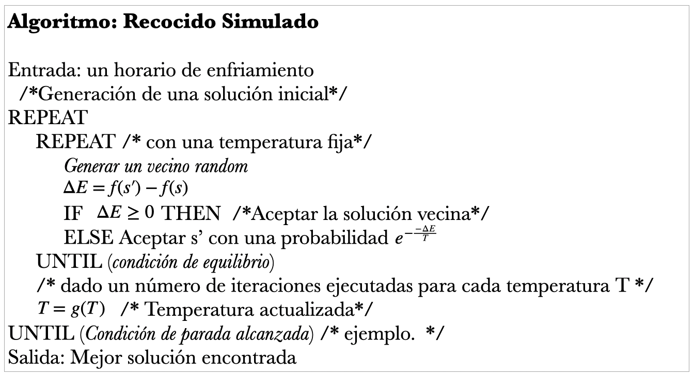

# Recocido simulado

## Objetivos

Los objetivos de esta unidad son:

Conocer los conceptos relacionados a la inspiración de SA
Conocer la idea principal del algoritmo de SA
Identificar aspectos teóricos y de diseño de SA
Ejemplo de aplicación de SA a un COP

# Introducción

La metahuerística de Recocido simulado o Simulated Anneling (SA) fue presopuesta por Kirpatrick en 1983. 

Lecturas recomendadas:

- S. Kirkpatrick, et al. Optimization by Simulated Annealing. Science, 220(4598): 671-680,1983
V. Cervyn. 
-  A thermodynamical approach to the traveling salesman problem: An efficient simulation algorithm. Journal of Optimization Theory and Applications, 45: 41-51, 1985.

“SA es un método de búsqueda probabilístico basado en una solución, inspirado en el proceso de recocido de metalurgia”. - Du, 2016.

“SA esta basado en los principios de mecánica estadística, según los cuales el proceso de recocido requiere calentar y luego enfriar lentamente una sustancia para obtener un estructura cristalina fuerte”. - Talbi, 2009.

## Algoritmo de Recocido Simulado

## Aspectos teóricos 

- Generación de una solución inicial
- Definición del vecindario
- Función de probabilidad de aceptación
- Secuencia de enfreamiento
- Condición de parada

### Función de probabilidad de aceptación

A medida que, el algoritmo progresa, la probabilidad de que esos movimientos sean aceptados disminuye.

$P(\Delta E, T) = e^{-\frac{\Delta E}{T}}$

Donde $T = kt$, $k$ es la distribución de Boltzmann, utiliza un parámetro de control, llamado temperatura $t$, para determinar la probabilidad de aceptar soluciones que no muestran mejorar. 

La probabilidad de aceptación de un movimiento que no mejora es:

$P(\Delta E, T)  > R$

### Secuencia de enfriamiento

Parámetros a considerar en una secuencia de enfriamiento  son:
- La temperatura inicial, 
- el estado de equilibrio, 
- una función de enfriamiento, 
- y la temperatura final que define el criterio de parada.

#### Temperatura inicial

_Aceptar todo_

Donde la temperatura se define lo suficientemente alta para aceptar todo durante la fase de inicial del algoritmo.

_Aceptación de desviación_

La temperatura inicial es calculada por $k\sigma$ usando experimentos previos, donde $\sigma$representa la desviación estándar de la diferencia entre valores de la función objetivo y $k=-3/ln(p)$con la probabilidad de aceptación de p, la cual es mayor que $3\sigma$.

_Tasa de aceptación_

La temperatura inicial se define de manera que la relación de aceptación de las soluciones sea mayor al valor predeterminado $a_0$

$T_0 = \frac{\Delta^+}{ln(m_1(a_0-1)/m_2 + a_0)}$

Donde $m_1$y $m_2$son el números de soluciones para ser disminuidas o incrementadas en experimentos preliminares, respectivamente y $\Delta^+$ es el promedio de valores incrementados en la función objetivo. Por ejemplo, la temperatura inicial deberá ser inicializada de tal manera que la tasa de aceptación este en el intervalo $[40\%, 50\%]$. 

#### Estado de equilibrio

Para alcanzar un estado de equilibrio en cada temperatura, un número de transiciones suficientes (movimientos) deben ser aplicados.

El número de iteraciones debe ser definido de acuerdo al tamaño del problema ejemplo y particularmente proporcional el tamaño del vecindario $|N(s)|$.

El numero de transiciones visitadas pues ser como sigue:
- Estático
- Adaptativo

#### Función de enfriamiento

La temperatura puede ser actualizada de dos maneras diferentes:

- Lineal
- Geométrica
- Logarítmica
- Disminución lenta
- No monótona
- Adaptativo    

[`Funciones de enfriamiento`](./code/function_cooling.ipynb)

## Ejemplo básico de aplicación

* [`SA - Función cúbica`](./code/sannealing_basic/sa_cubic_fuction.ipynb)
* [`SA - N-Queens`]()
