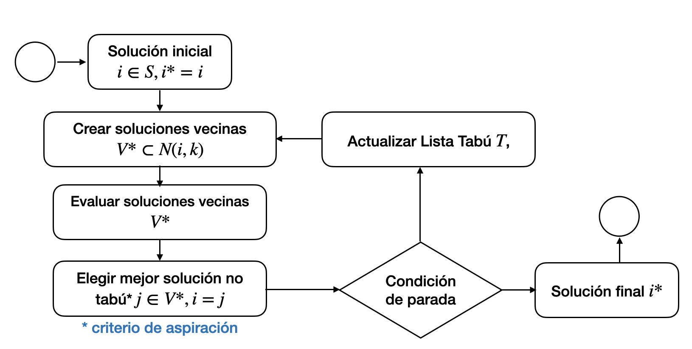

# Búsqueda Tabú

Comprender la metaheurística Búsqueda Tabú e identificar los elementos claves a través de ejemplo de optimización del problema del agente viajero.

Conocimientos previos
- Conceptos de optimización
- Complejidad computacional
- Algoritmos exactos y heurísticos
- Modelado de problemas de optimización
- Metaheurística de Recocido simulado

## Introducción

Búsqueda Tabú es un algoritmo de metaheurística para la solución de problemas de optimización combinatorio.

- Propuesto por Fred Glover en 1986.

Búsqueda Tabú (TS, Tabu Search) es una estrategia general para guiar y controlar heurísticas internas adaptadas específicamente a un problemas qué se plantee.

## Búsqueda Tabú clásica

Utiliza un algoritmo de búsqueda local que explora el espacio de soluciones mediante óptimos locales y adapta una estructura de memoria que imita el comportamiento humano.

### Principios de TS

- Memoria corto plazo
    - Lista tabú

- Memoria largo plazo
    - Frecuencias

### Algoritmo de TS

## Lista de candidatos

## Memoria de corto plazo

## Convergencia en TS

## Memoria de largo plazo

## Oscilaciones estrategicas

